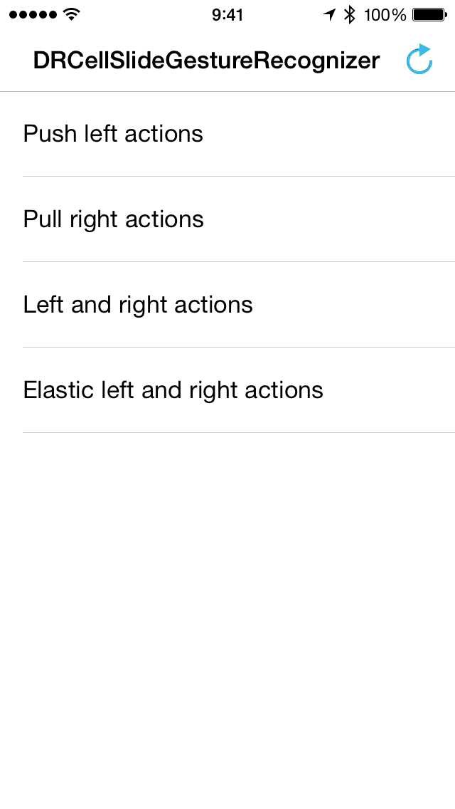

DRCellSlideGestureRecognizer
============================

<p align="center">
	
</p>

_Note: this library comes out as an abstraction of former PDGestureTableView's cell swiping logic. Since it's based on UIPanGestureRecognizer class, now there's a total independency on which UITableView and UITableViewCell classes it can interact with._

## Features

- __UITableView/UITableViewCell class agnostic__.
- Setup __multiple actions__ for __multiple cell fractions__.
- __Fully customizable__.
- __Block-driven__.

## Installation

#### CocoaPods

```ruby
pod 'DRCellSlideGestureRecognizer'
```

#### Manual

Drag and copy all files in the [__DRCellSlideGestureRecognizer__](DRCellSlideGestureRecognizer) folder into your project.

## At a glance

#### Setting up actions

Setting up an action is really simple, although you'll need a `DRCellSlideGestureRecognizer` instance to add them to first:

```objective-c
DRCellSlideGestureRecognizer *gestureRecognizer = [DRCellSlideGestureRecognizer new];
```

Then, simply instantiate `DRCellSlideAction` like this:

```objective-c
DRCellSlideAction *action = [DRCellSlideAction actionForFraction:0.25];
action.behavior = DRCellSlideActionPushBehavior;
action.icon = [UIImage imageNamed:@"imageName"];
```

_Note: `fraction` determines the part of the cell to where the action will become active and ready to be triggered._

And finally, add the action to the gesture recognizer, and the gesture recognizer to the cell:

```objective-c
[gestureRecognizer addActions:action];
[cell addGestureRecognizer:gestureRecognizer];
```

_Note: the given instructions should be performed inside tableView:cellForRowAtIndexPath: method._

#### Customizing actions

There are multiple `DRCellSlideAction` properties available for you to customize the appearence and interactivity of the cell:

- `behavior`: how the action will behave once triggered by the user. Possible values:
	- `DRCellSlideActionPullBehavior`: the cell returns to its original position.
	- `DRCellSlideActionPushBehavior`: the cell is pushed to the edge of the table.
- `icon`: the image to be displayed for the action.
- `iconMargin`: the margin for the icon.
- `activeColor`: the color of `icon` when the action is active.
- `inactiveColor`: the color of `icon` when the action is inactive.
- `activeBackgroundColor`: the background color when the action is active.
- `inactiveBackgroundColor`: the background color when the action is inactive.
- `elasticity`: the amount of elastic resistence for the cell to be dragged.
- `willTriggerBlock`: block that's triggered when the cell is about to behave accordingly to its `behavior` property.
- `didTriggerBlock`: block that's triggered when the cell has already behaved accordingly to its `behavior` property. Here you should perform the main task for the cell action.
- `didChangeStateBlock`: block that's triggered then the action reaches its active/unactive state.

## License

DRCellSlideGestureRecognizer is available under the MIT license.